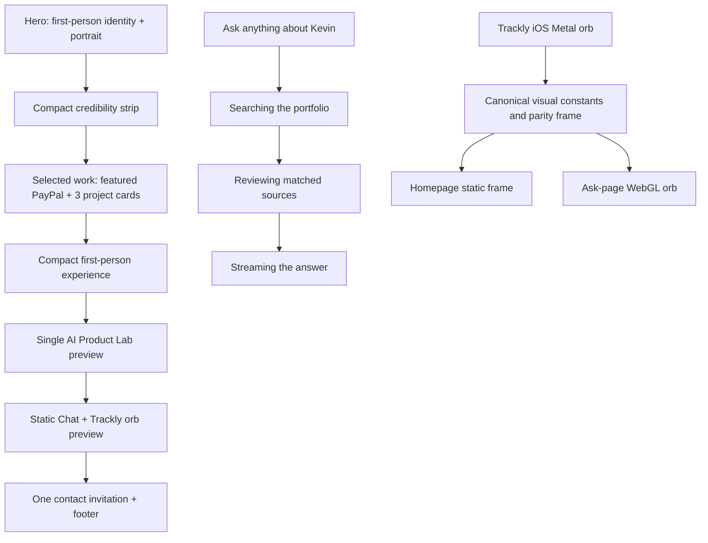

# Portfolio and Ask Experience Recovery - Plan

## Goal Capsule

- **Objective:** Recover the clarity, scale, and project visibility of the previously approved portfolio and make Ask feel more human while preserving evidence, privacy, and the grounded Chat/Voice architecture.
- **Authority:** Kevin's July 13 screenshot feedback overrides the current deployed composition; approved claims and public-safety boundaries remain fixed.
- **Execution profile:** A narrowly scoped voice-prompt PR in `trackly-app/close-ai` lands first, followed by the frontend recovery PR in `recruiting-portfolio`; both are reviewed before the recovered experience is enabled in production.
- **Stop conditions:** Do not implement until Kevin approves the wireframe direction. Do not merge or deploy a homepage that has not passed desktop Chrome, desktop Safari, mobile, and Kevin's final visual review.
- **Tail ownership:** The implementation owner runs the repo's build, Playwright, visual, accessibility, and PR gates; the base repo is synchronized only after the approved PR merges.

---

## Product Contract

### Summary

The homepage needs a visual recovery, not another strategy rewrite. The recommended direction is a hybrid restoration: return to the previous homepage's contained scale, first-person voice, visible project cards, and clear dividers while retaining the current recruiter/hiring-manager narrative, public evidence, color system, `/lab/`, and grounded Chat/Voice experiences. The Ask page needs the same humanization: simpler copy, honest activity feedback, natural keyboard behavior, a more relaxed voice prompt, and a darker stage for the Trackly orb.

### Problem Frame

The current composition treats most sections as oversized editorial posters. At real desktop and Safari widths, display copy collides with grid boundaries, screenshots are squeezed into secondary columns, separators become inconsistent, and project evidence becomes harder to scan. The result feels less like a portfolio for recruiters and product leaders and more like a sequence of art-directed panels.

The current page also introduces avoidable interaction mismatches: rotated Berkeley labels are hard to read, first-person authorship shifts into third-person copy, the homepage uses a CSS approximation instead of the Trackly voice orb, the resume icon promises a download while navigating to a page, the email button opens a mail client instead of copying the address, and the contact invitation appears twice across the page and global footer.

The Ask page compounds the same problem through oversized text, dense boundary language, artificial labels, and a voice prompt that repeatedly calls itself a synthetic guide and redirects visitors to Chat. Chat already streams answer deltas, but the interface hides its real retrieval and synthesis phases, making a grounded agent feel instant and deterministic instead of visibly active.

### Actors

- A1. Recruiters need to identify Kevin's positioning, credibility, strongest work, resume, and contact path quickly.
- A2. Hiring managers and product leaders need enough project decisions and evidence to judge scope, craft, and product thinking.
- A3. Kevin needs a homepage that feels like his voice and can be approved visually one section at a time.
- A4. Keyboard, zoom, reduced-motion, Safari, and mobile users need the same readable hierarchy and truthful interactions.

### Requirements

**Composition and hierarchy**

- R1. The homepage must use a contained, human-scale composition that remains readable from 360 to 1440 pixels without clipped text, overlapping rules, or horizontal overflow.
- R2. The hero must speak in first person, identify Kevin as an AI Product Manager, show PayPal and Berkeley credibility, and expose selected work, Ask, and resume paths without a mode switch.
- R3. Selected work must make PayPal, Trackly, Berkeley/MoBagel, and BCP visibly scannable as portfolio projects rather than hiding evidence inside oversized poster sections.
- R4. Section boundaries must use consistent visible rules or intentional background changes; unexplained blank separator bands are not acceptable.
- R5. The current warm paper, ink, deep purple, violet, and restrained lime palette must remain, with contrast adjusted only where readability requires it.

**Content and media**

- R6. Homepage narrative copy must use Kevin's first-person voice except where Kevin's clearly identified AI assistant speaks about him in third person.
- R7. PayPal, Trackly, and Berkeley media must preserve their intrinsic aspect ratios and remain legible; screenshots may not be squeezed or stretched to satisfy a column height.
- R8. Berkeley deliverables must read horizontally in normal reading order; rotated labels are prohibited.
- R9. Existing approved claims, prototype/POC boundaries, evidence sources, routes, structured data, and machine-readable artifacts must remain synchronized and truthful.

**Assistant and contact interactions**

- R10. The homepage assistant preview must remain static and lightweight, but its orb frame must be rendered from the same visual algorithm and tuning as Trackly iOS `VoiceOrbView` rather than a CSS radial-gradient approximation.
- R11. The Ask page's WebGL orb must be parity-checked against the iOS Metal source for colors, noise, alpha, rotation threshold, hover response, and size without changing Voice transport, grounding, tool choice, session limits, or microphone ownership; reduced motion intentionally uses one frozen canonical orb frame on the web.
- R12. The homepage must contain one primary contact invitation. Email must be a copy-to-clipboard button with an accessible “Email copied” confirmation and a manual-copy fallback.
- R13. Resume controls must match their behavior: “View resume” uses a document/navigation affordance, while a download icon appears only on a direct PDF download.
**Approval and quality**

- R14. Implementation must be reviewed through C1 Hero, C2 Credibility/transition, C3 Selected work, C4 Experience/Lab, C5 Homepage assistant/contact, C6 Chat, C7 Voice, and C8 Complete desktop/mobile pages.
- R15. No production deployment may occur until Kevin approves the complete homepage and Ask page in Chrome and Safari screenshots and all automated gates pass.

**Ask experience**

- R16. Ask-page headings, messages, composer, and controls must not overlap or collide at supported desktop, Safari, zoom, or mobile widths.
- R17. Chat must show concise, truthful activity states tied to real phases—searching the portfolio, reviewing matched sources, and writing the answer—then stream the answer text; it must never expose hidden chain-of-thought or invent tool activity.
- R18. The composer placeholder must be “Ask anything about Kevin.” Enter submits, Shift+Enter inserts a newline, IME composition is respected, and the Ask button remains available.
- R19. Ask-page copy must be concise and conversational. Remove “Grounded Chat,” “Answer grounded in public evidence,” the boundary badge row, and mode-explainer language from the primary experience; replace them with one short pre-start line that identifies an AI assistant, public-portfolio answers, and no transcript retention before microphone consent.
- R20. Voice must introduce itself once as “Kevin's AI assistant” in a relaxed tone, avoid repeating its identity, and never append an unsolicited suggestion to switch to Chat.
- R21. The Voice surface must give the Trackly orb a dark, high-contrast stage and make the 300-pixel orb the visual focus while keeping mute, end-call, and optional mode switching available.

### Key Flows

- F1. Portfolio scan
  - **Trigger:** A recruiter or product leader lands on `/`.
  - **Actors:** A1, A2
  - **Steps:** Identify Kevin and positioning; scan credibility; compare four projects; inspect experience; choose a case, Ask, resume, or contact.
  - **Outcome:** The visitor understands the portfolio without decoding decorative layouts.
- F2. Copy email
  - **Trigger:** A visitor selects the contact email control.
  - **Actors:** A1, A2, A4
  - **Steps:** Copy the approved address; announce success visually and through an ARIA live region; fall back to selectable text if Clipboard API access fails.
  - **Outcome:** The visitor leaves with the address without an unexpected mail-client launch.
- F3. Inspect voice
  - **Trigger:** A visitor sees the homepage preview or opens Voice on `/ask/`.
  - **Actors:** A1, A2, A4
  - **Steps:** See a visually faithful Trackly orb; opt into Voice on `/ask/`; use the existing realtime lifecycle.
  - **Outcome:** The assistant feels consistent with Trackly while preserving privacy, grounding, and resource ownership.

### Acceptance Examples

- AE1. At 1440-pixel Chrome and Safari widths, the PayPal headline stays within its column and the workbench image keeps its source aspect ratio with readable interface text.
- AE2. At 390 pixels, each project stacks copy before media, no display heading exceeds the viewport, and no section creates horizontal overflow.
- AE3. The Berkeley process reads left-to-right or top-to-bottom as Discovery, Figma, Roadmap, Pricing, U.S. GTM with no rotated text.
- AE4. Selecting “Copy email” writes the address to the clipboard, shows “Email copied,” announces the state to assistive technology, and does not navigate.
- AE5. “View resume” opens `/resume/` with a document or arrow affordance; “Download PDF” links directly to the PDF and is the only resume control using a download icon.
- AE6. The homepage orb's approved static frame and the Ask-page active orb match the iOS Trackly orb's purple, sky-blue, deep-navy, transparent-edge, and noise character at the same normalized state.
- AE7. Submitting a chat question immediately shows “Searching Kevin's portfolio,” a real retrieval `meta` event advances the state to “Reviewing sources,” and the first answer delta advances the state to “Writing answer” while text streams into the response.
- AE8. Pressing Enter submits one non-empty question; Shift+Enter creates a newline; Enter during IME composition does not submit.
- AE9. Before microphone consent, Voice visibly identifies an AI assistant and the no-transcript boundary; after consent it says a short “Hey, I'm Kevin's AI assistant” introduction once per call and answers later turns without repeating the introduction or recommending Chat.
- AE10. At 390, 768, 1024, and 1440 pixels, Voice presents a centered 300-pixel orb on black or approved deep purple without clipping or competing explanatory chrome.

### Scope Boundaries

**In scope**

- Homepage layout, typography scale, section spacing, project presentation, media sizing, first-person copy corrections, orb visual parity, contact semantics, and visual regression coverage.
- Small shared components needed for a single contact interaction or a shader-derived static orb frame.
- `/ask/` Chat/Voice composition, copy, composer keyboard behavior, truthful SSE activity labels, dark orb presentation, and the narrowly scoped Realtime prompt wording change.

**Deferred to follow-up work**

- A broader narrative rewrite of all case studies and resume content.
- Changes to grounded retrieval ranking, answer synthesis, Realtime token minting, session limits, analytics, or deployment configuration.
- Redesigns of `/lab/`, case-study pages, or `/resume/` beyond link semantics required by this recovery.

**Explicitly excluded**

- Reintroducing the Recruiter/Builder/Agent switch.
- Copying the 21st.dev React component, microphone handling, runtime dependencies, or API integration.
- Editing TracklyApp or TracklyWeb; they are read-only references for the visual and interaction contracts.
- Showing chain-of-thought, hidden reasoning, fabricated tool calls, or artificial delays that do not correspond to real work.
- Adding browsing, private tools, transcript display, account access, or conversation persistence.
- Direct pushes to `main` or production environment-variable changes.

---

## Planning Contract

### Key Technical Decisions

- KTD1. **Use a hybrid restoration, not a literal rollback.** The previous homepage supplies the composition principles that worked: contained width, moderate typography, first-person identity, clear project cards, and strong rules. The current release supplies the approved route hierarchy, evidence boundaries, `/lab/`, and Chat/Voice architecture.
- KTD2. **Replace poster-sized stories with a repeatable project system.** Use one featured PayPal card plus a balanced project grid for Trackly, Berkeley/MoBagel, and BCP. This restores scanability while preserving PayPal priority.
- KTD3. **Use bounded type and media contracts.** Headings receive explicit maximum measures and conservative `clamp()` ceilings; grid tracks use `minmax(0, 1fr)`; project media uses intrinsic aspect ratios with `object-fit: contain` unless a crop is explicitly approved.
- KTD4. **Generate the homepage orb frame from the canonical shader.** The iOS Metal source and driver are the visual source of truth. The homepage stays static, but the frame must come from the same algorithm and constants; the Ask page remains a WebGL port driven by the existing shared audio level.
- KTD5. **Make control semantics literal.** Icons and labels describe the action that occurs: external arrow for LinkedIn, copy icon for email, document/arrow for the resume page, and download only for the PDF.
- KTD6. **Separate structural recovery from later copy refinement.** This pass corrects third-person phrasing and duplication but does not reopen every headline, metric, or case-study narrative.
- KTD7. **Approve locally before merge.** Each visual checkpoint is captured at real browser widths and reviewed before the next section is polished; production is not the feedback environment.
- KTD8. **Make agent activity truthful, not theatrical.** The client maps existing lifecycle signals to three plain-language states: submission starts portfolio search, retrieval `meta` confirms source review, and the first `delta` confirms answer writing. No hidden reasoning is requested or rendered.
- KTD9. **Humanize the voice prompt without weakening its boundary.** The Realtime prompt keeps required `lookup_portfolio` grounding and third-person factual speech but moves AI identity disclosure to one casual opening and removes the recurring Chat referral. A single concise pre-start disclosure remains visible before microphone consent.
- KTD10. **Treat web reduced motion as an explicit platform exception.** Trackly iOS keeps its static waveform symbol; the portfolio web renders one frozen canonical orb frame with the same accessible state label so the dark Voice composition does not visually collapse.

### High-Level Technical Design

### Sequencing

The implementation starts by locking the responsive layout and reusable project-media contract. It then moves from the top of the page downward so each checkpoint can be approved without unrelated lower-page changes obscuring the result. Orb and contact behavior land after the main composition is stable, followed by cross-browser visual verification and the normal PR gate.

### Visual Checkpoint Contract

| ID | Surface | Approval evidence |
|---|---|---|
| C1 | Hero | Chrome, Safari, and 390-pixel captures with first-person copy and bounded type |
| C2 | Credibility/transition | Visible strip borders and no blank separator band |
| C3 | Selected work | PayPal, Trackly, Berkeley, and BCP at desktop, tablet, and mobile widths |
| C4 | Experience/Lab | First-person experience and one compact Lab preview |
| C5 | Homepage assistant/contact | Canonical static orb, one contact invitation, and literal control semantics |
| C6 | Chat | Empty, searching, reviewing, streaming, completed, fallback, and composer states |
| C7 | Voice | Every row in the Voice State Contract on the dark stage |
| C8 | Complete pages | Full homepage and Ask page at desktop and mobile widths |

### Responsive Layout Contract

| Viewport | Hero | Selected work | PayPal media | Supporting cards |
|---|---|---|---|---|
| 360-767 px | Single column with compact portrait identity row | All projects stack in reading order | Below copy, full width, protected 16:9 or source ratio | One column |
| 768-1023 px | Two balanced columns only when each copy track remains readable | PayPal spans full width; Trackly and Berkeley use two columns; BCP remains full width or in Experience | Below PayPal copy, minimum readable width | Two columns with explicit spans |
| 1024-1439 px | Contained two-column identity/copy | PayPal may split copy/media; remaining projects use explicit two-column spans | At least half the card width with `object-fit: contain` | Two columns |
| 1440 px and above | Canvas remains capped; type no longer scales with viewport | Same as 1024-1439 without wider copy measures | Intrinsic ratio within capped canvas | Same explicit spans |

Copy precedes media in the DOM at every width. Display headings use a bounded measure and must remain inside their assigned grid track at 200% zoom.

### Voice State Contract

| State | Visible status | Orb behavior | Controls | Recovery / next action |
|---|---|---|---|---|
| `intro` | One concise AI/no-transcript disclosure | Frozen canonical frame on dark stage | Start Voice, switch to Chat | Start requests microphone; focus remains on Start until action |
| `connecting` | “Connecting…” | Gentle idle motion | End, switch to Chat | Timeout moves to `failed`; End returns focus to Start |
| `listening` | “Listening” | Microphone level | Mute, end, switch to Chat | User speaks or ends call |
| `speaking` | “Speaking” | Remote-agent level | Mute, end, switch to Chat | Barge-in returns to `listening` |
| `reconnecting` | “Reconnecting…” | Bounded idle motion | End, switch to Chat | Success returns to `listening`; exhausted retry moves to `failed` |
| `microphone_denied` | Short permission explanation | Frozen canonical frame | Try again, switch to Chat | Focus moves to Try again |
| `failed` | Human error copy | Frozen canonical frame | Try again, switch to Chat | Retry starts a new bounded connection attempt |
| `ended` | “Call ended” with source links | Frozen canonical frame | Start another call, switch to Chat | No transcript or automatic mode change |

### Risks and Mitigations

- **Visual overcorrection:** A literal rollback could restore the rejected mode switch or lose current evidence. Mitigate by reusing composition principles, not the old page wholesale.
- **Safari text metrics:** Tight display line-height and aggressive tracking can clip or collide differently in Safari. Mitigate with conservative line-height, measured headings, and Safari screenshots at every supported desktop breakpoint.
- **Orb “same code” but different result:** Shader parity can still drift through canvas sizing, alpha, time, and driver constants. Mitigate with canonical state fixtures and side-by-side reference captures.
- **Clipboard restrictions:** The Clipboard API may be unavailable outside a secure context or denied. Mitigate with a tested manual-copy fallback and no false success toast.
- **CSS regression from accumulated styles:** `src/pages/index.astro` currently contains legacy and v2 rules in one large stylesheet. Mitigate by deleting superseded homepage rules only after selectors are mapped and visual characterization exists.

---

## Implementation Units

### U1. Characterize and lock the visual contract

- **Goal:** Establish the approved baseline and measurable layout constraints before changing the homepage.
- **Requirements:** R1, R4, R5, R14, R15; AE1, AE2
- **Dependencies:** None
- **Files:** `src/pages/index.astro`, `tests/portfolio.spec.mjs`, `tests/safari-smoke.spec.mjs`, `tests/visual/homepage.spec.mjs`, `tests/visual/homepage-baseline/`
- **Approach:** Add focused visual and geometry assertions for heading containment, section rules, project-media ratios, and overflow. Capture current and previous compositions at 390, 768, 1024, and 1440 pixels in Chrome plus the existing Safari smoke surface. Treat Kevin's screenshots as failure evidence, not golden baselines.
- **Patterns to follow:** Existing Playwright route, overflow, and Safari smoke coverage.
- **Test scenarios:** Reproduce the PayPal clipping at the affected narrow desktop width; verify no horizontal overflow at all required widths; assert every expected section boundary renders; capture Chrome and Safari approval images.
- **Verification:** The test suite fails on the current layout for the same geometry problems visible in Kevin's screenshots and provides stable checkpoints for later units.

### U2. Recover hero and credibility composition

- **Goal:** Restore a concise, first-person, human-scale opening that serves recruiters and product leaders.
- **Requirements:** R1, R2, R4, R5, R6, R14
- **Dependencies:** U1
- **Files:** `src/pages/index.astro`, `src/data/site.js`, `tests/portfolio.spec.mjs`, `tests/visual/homepage.spec.mjs`
- **Approach:** Rebuild the hero from the previous contained composition without restoring the mode switch. Keep portrait, positioning, PayPal, Berkeley, Bay Area, selected-work, Ask, and resume paths. Reduce display scale, constrain copy measure, keep the credibility strip compact, and remove unexplained whitespace between it and Selected Work.
- **Patterns to follow:** The identity/project balance in the pre-v2 homepage and the current approved hero content order.
- **Test scenarios:** Verify first-person copy and required links; verify title and lede fit at 200% zoom; verify credibility items remain readable at desktop and stack predictably on mobile.
- **Verification:** C1 and C2 are ready for Kevin's desktop Chrome, desktop Safari, and 390-pixel review before U3 proceeds.

### U3. Restore a scannable selected-work system

- **Goal:** Make the four strongest projects easy to compare without sacrificing evidence or media legibility.
- **Requirements:** R1, R3, R4, R5, R7, R8, R9, R14; AE1, AE2, AE3
- **Dependencies:** U2
- **Files:** `src/pages/index.astro`, `src/data/site.js`, `src/data/claims.js`, `tests/portfolio.spec.mjs`, `tests/visual/homepage.spec.mjs`
- **Approach:** Use a featured PayPal card with a protected media ratio, followed by balanced Trackly, Berkeley/MoBagel, and BCP cards. Keep claim wording sourced from the existing registry. Replace the rotated Berkeley labels with a horizontal or stacked numbered sequence. Preserve explicit shipped/prototype/reconstruction labels.
- **Patterns to follow:** The previous homepage project-card system, current claim registry, and existing case routes.
- **Test scenarios:** Assert project order and all four links; assert PayPal media aspect ratio and non-stretching; assert Berkeley labels have horizontal writing mode; verify cards stack without overflow at 360 and 390 pixels.
- **Verification:** C3 is ready for Kevin's desktop, tablet, and mobile review before U4 proceeds.

### U4. Simplify experience and supporting sections

- **Goal:** Keep experience, Lab, and the assistant preview useful without returning to oversized poster sections.
- **Requirements:** R1, R4, R5, R6, R9, R10, R14
- **Dependencies:** U3
- **Files:** `src/pages/index.astro`, `src/data/site.js`, `tests/portfolio.spec.mjs`, `tests/visual/homepage.spec.mjs`
- **Approach:** Rewrite only obvious third-person homepage phrasing into first person. Keep expandable experience evidence, one Lab preview, and a static assistant preview, but reduce headline scale and section height. Use one intentional divider/background transition between each section.
- **Patterns to follow:** Current experience data and `/lab/` architecture; prior homepage's compact proof bands.
- **Test scenarios:** Verify experience details remain keyboard-operable; verify first-person homepage copy; verify Lab and Ask links; verify no duplicate assistant initialization or microphone request occurs on `/`.
- **Verification:** C4 is ready for Kevin's desktop and mobile review; homepage assistant composition remains provisional until U5 and U6 land.

### U5. Match the Trackly iOS orb across static and active states

- **Goal:** Make the homepage preview and Ask-page Voice experience visibly match the Trackly iOS voice-onboarding orb.
- **Requirements:** R10, R11; AE6
- **Dependencies:** U4
- **Files:** `src/components/portfolio/PortfolioVoiceOrb.tsx`, `src/components/portfolio/PortfolioVoiceExperience.tsx`, `src/pages/index.astro`, `public/assets/portfolio-orb-static.webp`, `tests/portfolio.spec.mjs`, `tests/visual/homepage.spec.mjs`, `tests/visual/voice-orb.spec.mjs`
- **Approach:** Treat `TracklyApp/TracklyApp/Views/Components/VoiceOrbView.swift` and `TracklyApp/TracklyApp/Views/Components/Shaders/VoiceOrb.metal` as read-only source references. Align the WebGL driver's threshold, idle behavior, hover math, alpha, 60-fps ceiling, size, and reduced-motion frame. Produce the homepage static asset from that same canonical shader state; remove the CSS radial-gradient approximation. Keep the WebRTC session as the sole microphone owner.
- **Patterns to follow:** Existing WebGL cleanup and context-loss handling in `PortfolioVoiceOrb.tsx`; iOS `VoiceOrbView` normalized idle/speaking states.
- **Test scenarios:** Compare deterministic idle and speaking frames against approved iOS references; verify reduced motion renders one static frame; verify WebGL fallback is visually intentional; verify mount/unmount releases animation and WebGL resources; verify the homepage requests no microphone permission.
- **Verification:** Deterministic idle, speaking, and reduced-motion parity frames match the approved Trackly reference; final C5 and C7 composition approval waits for U7.

### U6. Correct contact and resume semantics

- **Goal:** Provide one concise contact invitation with actions that behave exactly as their labels and icons imply.
- **Requirements:** R6, R12, R13; AE4, AE5
- **Dependencies:** U4
- **Files:** `src/components/Footer.astro`, `src/pages/index.astro`, `src/layouts/BaseLayout.astro`, `tests/portfolio.spec.mjs`
- **Approach:** Remove the homepage `.contact-v2` block and retain `Footer.astro` as the single primary contact source, including the homepage `#contact` destination. Add a progressively enhanced Astro button with a tiny CSP-compatible module script for clipboard state, modeled on TracklyWeb's `footer-v3.tsx` but styled for this portfolio. Use an external-link affordance for LinkedIn, a copy affordance for email, a document/navigation affordance for `/resume/`, and reserve download for the direct PDF control.
- **Patterns to follow:** TracklyWeb's clipboard success/fallback lifecycle and the portfolio's existing CSP-safe inline interaction patterns.
- **Test scenarios:** Verify clipboard success, rejection fallback, ARIA live announcement, reset timing, keyboard operation, and no navigation; verify resume navigation and PDF download labels/icons differ.
- **Verification:** Contact appears once and all three actions pass behavioral tests; C5 approval waits for the combined homepage review in U7.

### U7. Cross-browser validation and guarded rollout

- **Goal:** Prove the recovered homepage works visually and functionally before merge and production deployment.
- **Requirements:** R1-R21; AE1-AE10
- **Dependencies:** U5, U6, U8
- **Files:** `tests/portfolio.spec.mjs`, `tests/safari-smoke.spec.mjs`, `tests/visual/homepage.spec.mjs`, `playwright.config.mjs`, `.context/visual-approval/homepage-recovery/`
- **Approach:** Run the full build and browser suite, capture the six homepage checkpoints plus Chat and Voice states at 360, 390, 430, 768, 1024, and 1440 pixels, inspect Chrome and Safari, test 200% zoom and reduced motion, and run accessibility checks. Merge and deploy the backend prompt contract before the frontend depends on it. Open each PR only after local approval; follow the repository review gate and merge-commit workflow; verify production only after merge.
- **Patterns to follow:** Existing PR discipline, Playwright route matrix, Axe coverage, and mandatory visual-proof workflow.
- **Test scenarios:** Full route regression; Chrome/Safari geometry and screenshot comparison; keyboard-only flow; 200% zoom; reduced motion; Clipboard API denial; WebGL unavailable; no-JavaScript homepage path.
- **Verification:** `npm run build` and `npm test` pass, visual checkpoints are approved, required reviewers and CI are clean, production matches the approved captures, and no session-owned runtime remains after verification.

### U8. Humanize Chat and Voice

- **Goal:** Make `/ask/` feel like a capable, relaxed assistant instead of a compliance explainer or instant deterministic form.
- **Requirements:** R16-R21; AE7-AE10
- **Dependencies:** U1, U5
- **Files:**
  - **`recruiting-portfolio`:** `src/pages/ask/index.astro`, `src/components/portfolio/PortfolioAssistant.tsx`, `src/components/portfolio/PortfolioVoiceExperience.tsx`, `tests/portfolio.spec.mjs`, `tests/visual/ask.spec.mjs`
  - **`trackly-app/close-ai`:** `src/services/portfolio-voice.ts`, `src/services/__tests__/portfolio-voice.test.ts`, `src/routes/__tests__/portfolio-assistant.test.ts`
- **Approach:** Simplify the Ask hero to a welcoming title and one short line; remove the boundary-pill row and artificial mode explanations. Recompose Chat as a normal conversation surface with bounded typography and a compact composer. Map the existing SSE lifecycle to visible activity states and keep actual answer deltas streaming. Add Enter/Shift+Enter/IME composer behavior and the open placeholder. Recompose Voice on a black or approved deep-purple stage with the 300-pixel Trackly orb as hero. Keep one concise pre-start AI/no-transcript line before microphone consent. Update the backend Realtime prompt to introduce “Kevin's AI assistant” once, stay conversational, keep factual `lookup_portfolio` grounding, and stop advertising Chat after each answer.
- **Execution note:** The backend prompt PR lands and is verified first; the frontend copy and state presentation must not imply a prompt contract that production has not received.
- **Patterns to follow:** Existing `meta`, `delta`, `citations`, `done`, and fallback handling in `PortfolioAssistant.tsx`; existing required tool contract in `portfolio-voice.ts`; Trackly voice onboarding's dark, orb-first presentation.
- **Test scenarios:** Verify lifecycle labels correspond to real events and disappear at completion; verify answer deltas visibly stream without artificial delay; verify fallback never claims model activity; verify Enter, Shift+Enter, empty input, loading lock, and IME composition; verify removed phrases are absent from primary UI; verify the concise AI/no-transcript disclosure is visible and announced before `getUserMedia`; verify the voice instructions contain one casual introduction, required lookup, no repeated identity instruction, and no Chat referral; verify every Voice state contract row on the dark stage at all required widths.
- **Verification:** C6 and C7 are complete candidates: Chat exposes real work without artificial pauses, and Voice introduces itself once, answers directly, and matches the Trackly orb-first experience; final approval occurs in U7.

---

## Verification Contract

| Gate | Applies to | Required outcome |
|---|---|---|
| `npm run build` | U1-U8 | Claim validation, generated artifacts, Astro checks, build, resume generation, and dist validation pass. |
| `npm test` | U1-U8 | Full build and Playwright suite pass. |
| Chrome visual matrix | U1-U8 | No clipping, collision, stretching, missing dividers, or horizontal overflow at 360, 390, 430, 768, 1024, and 1440 pixels. |
| Safari visual matrix | U1-U8 | Hero, PayPal, Berkeley, Chat, Voice, orb, and contact match the approved geometry and remain readable. |
| Accessibility review | U2-U8 | Axe has no serious/critical violations; keyboard, focus, live-region, reduced-motion, and 200% zoom behavior pass. |
| Orb parity review | U5 | Approved iOS reference and WebGL/static frames match in algorithm, palette, edge transparency, and state behavior. |
| `trackly-app/close-ai` build, typecheck, and tests | U8 | The voice prompt contract retains required lookup grounding and removes repeated synthetic-guide/Chat-referral behavior. |
| Ask interaction matrix | U8 | Real activity states, streamed deltas, Enter/Shift+Enter/IME behavior, simplified copy, and dark Voice layout pass in Chrome and Safari. |
| Kevin visual approval | U2-U7 | All six checkpoints and the complete desktop/mobile homepage are explicitly approved before merge. |
| PR and deployment gate | U7 | Branch, review, CI, merge commit, deployment, production verification, and base-repo synchronization follow repository rules. |

---

## Definition of Done

- The homepage feels like a portfolio again: identity and four projects are scannable before supporting Lab and assistant material.
- No supplied screenshot failure remains: headlines do not collide, media is not compressed, dividers are intentional, Berkeley labels are not rotated, and duplicate contact content is gone.
- All homepage-authored narrative is in Kevin's first person, apart from clearly labeled synthetic-guide speech.
- The homepage static orb and Ask-page active orb match the Trackly iOS Metal orb's approved appearance and state behavior.
- Email copies with accessible confirmation and fallback; resume and download controls use accurate semantics.
- Chat shows truthful retrieval/writing activity, streams answer deltas, and supports natural keyboard submission without exposing hidden reasoning.
- Voice identifies itself once as Kevin's AI assistant, stays relaxed and direct, never repeats synthetic-guide language, and does not push visitors to Chat.
- Approved claims, routes, structured data, public-safety boundaries, Chat grounding, Voice transport, required tool contract, session limits, and microphone ownership are unchanged; only the approved Realtime prompt wording changes.
- Automated and manual verification gates pass in Chrome, Safari, mobile, zoom, reduced motion, keyboard, WebGL fallback, and clipboard-denial conditions.
- Kevin approves every visual checkpoint and the complete page before the PR merges.
- The final diff contains no abandoned experiments, superseded homepage CSS, debug logging, unused assets, or unrelated redesign work.

---

## Appendix

### Local sources that shaped the plan

- `src/pages/index.astro` — current v2 composition and accumulated legacy/v2 CSS.
- `src/components/portfolio/PortfolioVoiceOrb.tsx` — current WebGL shader port and cleanup lifecycle.
- `tests/portfolio.spec.mjs` and `tests/safari-smoke.spec.mjs` — existing responsive and browser coverage.
- Git commit `d0366e3` version of `src/pages/index.astro` — the previous contained identity and project-card composition.
- Read-only reference: `TracklyApp/TracklyApp/Views/Components/VoiceOrbView.swift` — canonical driver, tuning, accessibility, and 60-fps behavior.
- Read-only reference: `TracklyApp/TracklyApp/Views/Components/Shaders/VoiceOrb.metal` — canonical visual algorithm and palette.
- Read-only reference: `TracklyWeb/src/components/landing/footer-v3.tsx` — approved copy-email confirmation and fallback pattern.

External research was not load-bearing. The recovery decisions come from Kevin's screenshots, the current and previous portfolio implementations, and the existing Trackly production patterns he named as references.
